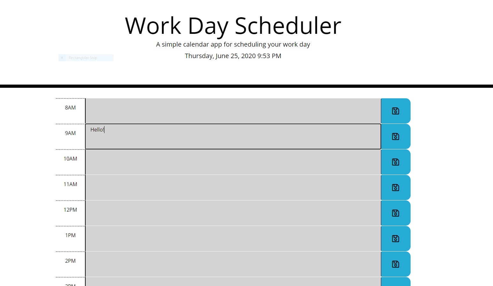

# UT-HW5-Day-Scheduler

URL: https://sircrouchalot.github.io/UT-HW5-Day-Scheduler/

Image: 

My Work Day Scheduler displays time blocks for each business hour. If the time has passed, it becomes grey. If it is the current hour, the block displays red, and if that time is in the future, the block displays green.

If you type in the time block box, you are typing in a text area. If you click the save button on the right, what you typed will be entered into local storage corresponding to that time. If you then, refresh the page, your input will stay in the time block.

If you do not click 'save,' your input will disappear, as it is not saved. Likewise if you delete input but do not save, your input will reappear on refresh.